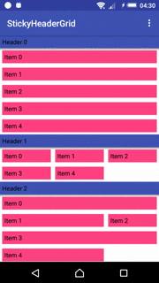

# Sticky Header Grid Layout Manager
[ ](https://bintray.com/codewaves/maven/sticky-header-grid/_latestVersion)
[](https://travis-ci.org/Codewaves/Sticky-Header-Grid)
[](https://www.codacy.com/app/Codewaves/Sticky-Header-Grid?utm_source=github.com&amp;utm_medium=referral&amp;utm_content=Codewaves/Sticky-Header-Grid&amp;utm_campaign=Badge_Grade)
[](https://github.com/Codewaves/Sticky-Header-Grid/blob/master/LICENSE.txt)

Android RecyclerView sticky header list/grid layout.



## Download

Download [the latest AAR][1] or grab via Gradle:
```groovy
compile 'com.codewaves.stickyheadergrid:stickyheadergrid:0.9.1'
```

## Features

* Sticky section headers
* Individually control header stickiness
* Span support like in GridLayoutManager
* Header bottom shadows
* Header state listener
* Smooth scrolling
* Scrollbars

## Usage

To use library:

1. Implement an adapter by subclassing StickyHeaderGridAdapter
2. Create holder class for each header and item type. Use HeaderViewHolder and ItemViewHolder as base classes.
3. Override and implement getSectionCount(), getSectionItemCount(int section), onCreateHeaderViewHolder(ViewGroup parent, int headerType), 
onCreateItemViewHolder(ViewGroup parent, int itemType), onBindHeaderViewHolder(HeaderViewHolder viewHolder, int section), 
onBindItemViewHolder(ItemViewHolder viewHolder, int section, int offset).
4. Create a StickyHeaderGridLayoutManager with required column count and assign it to your RecyclerView.
5. Use only StickyHeaderGridAdapter::notify* methods

If you need the position of an item in a click listener, always use holder .getAdapterPosition() which will have 
the correct adapter position.
 
```java
holder.<clickable view>.setOnClickListener(new View.OnClickListener() {
   @Override
   public void onClick(View v) {
      final int section = getAdapterPositionSection(holder.getAdapterPosition());
      final int offset = getItemSectionOffset(section, holder.getAdapterPosition());

      // Do click action here using setction and offset
   }
});
```

### Span support

Like in GridLayoutManager, use SpanSizeLookup to provide span information.

### Individual stickiness

Override adapter isSectionHeaderSticky method and return `true` to make section header 
sticky, `false` otherwise.

### Header bottom shadow

Because of the limitation of old Android platforms we cannot use an elevation. Little workaround 
was made to support bottom header shadows. Use layout manager .setHeaderBottomOverlapMargin 
method to set size of the header overlapping part and insert shadow into header layout. Overlapping
part will be drawn over the first section item.

### Header state listener

Use HeaderStateChangeListener to receive information about headers state.

## Other features

If you missing some feature, feel free to create an issue or pull request.

## Author

Sergej Kravcenko - [Codewaves][2]


## License

    The MIT License (MIT)

    Copyright (c) 2017 Sergej Kravcenko

    Permission is hereby granted, free of charge, to any person obtaining a copy
    of this software and associated documentation files (the "Software"), to deal
    in the Software without restriction, including without limitation the rights
    to use, copy, modify, merge, publish, distribute, sublicense, and/or sell
    copies of the Software, and to permit persons to whom the Software is
    furnished to do so, subject to the following conditions:

    The above copyright notice and this permission notice shall be included in all
    copies or substantial portions of the Software.

    THE SOFTWARE IS PROVIDED "AS IS", WITHOUT WARRANTY OF ANY KIND, EXPRESS OR
    IMPLIED, INCLUDING BUT NOT LIMITED TO THE WARRANTIES OF MERCHANTABILITY,
    FITNESS FOR A PARTICULAR PURPOSE AND NONINFRINGEMENT. IN NO EVENT SHALL THE
    AUTHORS OR COPYRIGHT HOLDERS BE LIABLE FOR ANY CLAIM, DAMAGES OR OTHER
    LIABILITY, WHETHER IN AN ACTION OF CONTRACT, TORT OR OTHERWISE, ARISING FROM,
    OUT OF OR IN CONNECTION WITH THE SOFTWARE OR THE USE OR OTHER DEALINGS IN THE
    SOFTWARE.

 [1]: https://bintray.com/codewaves/maven/sticky-header-grid/_latestVersion
 [2]: http://www.codewaves.com